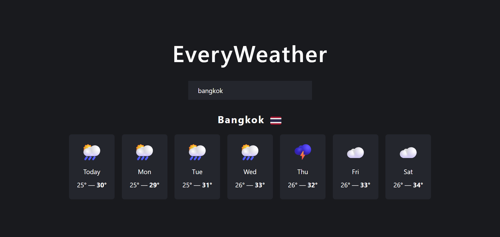

# ⛅ EveryWeather App

A simple and elegant weather app built with React. Enter any city and instantly get a 7-day weather forecast with temperature, and weather icons.

### 🌐 Live Demo

👉 [Try the live Application!](everyweather-app-project.vercel.app)

---

## 📸 Screenshots



---

## ✨ Features

- 🔍 **Search by City**: Type any location name to get real-time geolocation and weather forecast.
- 🌤️ **Daily Forecast**: View 7-day weather info including max/min temperatures and condition icons.
- 🌍 **Smart Country Flag**: Automatically shows country flag emoji next to the city name (if supported).
- 💾 **Persistent Location**: Remembers the last searched location using `localStorage`.
- 💀 **Error Handling**: Clear, user-friendly error messages for missing or invalid data.

---

## 🧠 Learning Goals

This project was developed to reinforce core React development concepts:

- **Component Structure**: Modular folder structure separating logic, components, and utilities.
- **React Hooks**:
  - `useState` for local state
  - `useEffect` for side effects like API fetching
- **Data Fetching**:
  - Fetching geolocation and weather data from Open-Meteo APIs.
- **Conditional Rendering**: Display loading state, errors, or data based on current app state.

---

### 🛠️ Technology Stack

| Tech               | Description                               |
| ------------------ | ----------------------------------------- |
| **React**          | JavaScript UI library (v18+)              |
| **JavaScript**     | Modern ES6+ features                      |
| **Vite**           | Modern build tool and dev server          |
| **Open-Meteo API** | Free geolocation and weather forecast API |

---

## 🚀 Installation & Setup

1. **Clone the repository**

   ```bash
   git clone https://github.com/nkieu-config/everyweather-app-project.git
   ```

2. **Install dependencies**

   ```bash
   npm install
   ```

3. **Start the development server**

   ```bash
   npm run dev
   ```

⚠️ Requires Node.js and npm installed.

---

## 📚 Course Credit

This project was built as part of **[The Ultimate React Course 2025](https://www.udemy.com/course/the-ultimate-react-course/)** by [Jonas Schmedtmann](https://codingheroes.io/)

---

## 📃 License

This is a personal learning project and not intended for production use.
